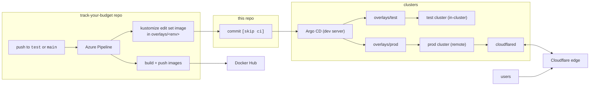
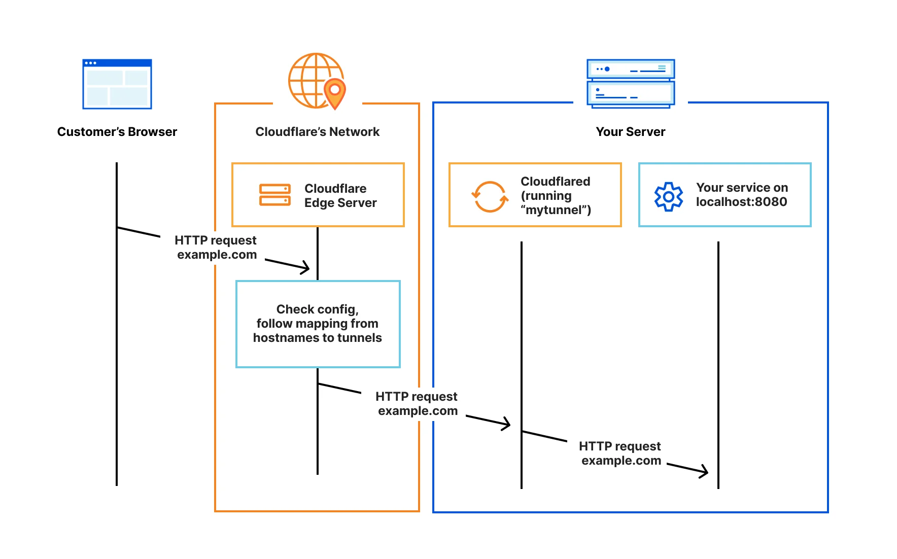
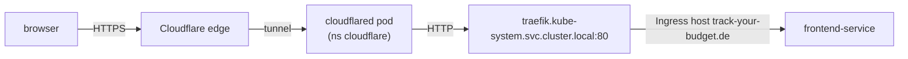

# app-manifests

Kubernetes manifests for [Track Your Budget](https://github.com/Eduard1999Gol/Track-Your-Budget),
managed with Kustomize and deployed by Argo CD. This repository is the single
source of truth for what runs in the test and prod clusters: nothing is
`kubectl apply`ed by hand except the three Secrets described below.

---

## How a change reaches a cluster



| Branch in app repo | Overlay | Cluster | Ingress host | Argo CD Application |
| --- | --- | --- | --- | --- |
| `test` | `overlays/test` | dev server, same cluster as Argo CD | `dev.track-your-budget.de` (HTTP) | `budget-app-test` |
| `main` | `overlays/prod` | prod server (k3s, single node) | `track-your-budget.de` (HTTPS, via Cloudflare Tunnel) | `budget-app-production` |

The pipeline only ever touches the `images:` block of an overlay. Everything
else in this repo is edited by hand and reviewed like code.

---

## Layout

```
.
├── base/
│   ├── backend.yaml        Deployment (migrate init container + gunicorn), Service "backend", media PVC
│   ├── frontend.yaml       Deployment (nginx serving the SPA, proxies /api to "backend"), Service
│   ├── ingress.yaml        Traefik Ingress, host track-your-budget.de → frontend-service
│   └── kustomization.yaml
├── overlays/
│   ├── test/
│   │   ├── kustomization.yaml   namespace, image tags, host/DEBUG/JWT patches
│   │   └── postgres.yaml        Postgres running IN the cluster (Deployment + PVC + Service "postgres")
│   └── prod/
│       ├── kustomization.yaml   image tags only; pulls in app/ and cloudflared.yaml
│       ├── cloudflared.yaml     Namespace "cloudflare" + cloudflared Deployment (Cloudflare Tunnel connector)
│       └── app/
│           ├── kustomization.yaml   namespace, ALLOWED_HOSTS/JWT/DEBUG patches
│           └── postgres.yaml        Postgres running ON the host, exposed as Service "postgres"
└── secrets/
    ├── backend-secret.template.yaml      copy, fill in, apply by hand (see Secrets)
    ├── frontend-secret.template.yaml
    └── cloudflared-secret.template.yaml  prod only: the tunnel token
```

`overlays/prod` is split in two levels on purpose. A kustomization's
`namespace:` is forced onto every resource it emits, and the app must be in
`default` while cloudflared must stay in `cloudflare`. So `app/` carries the
`namespace: default` and the patches, and the top level carries only the
`images:` block (which still applies to the Deployments coming out of `app/`)
plus `cloudflared.yaml`. The pipeline keeps running `kustomize edit set image`
in `overlays/prod`, unchanged.

Two names are load-bearing and must not change:

- Service **`backend`**: the frontend image has `proxy_pass http://backend:8000` baked in.
- Service **`postgres`**: `backend-secret` sets `POSTGRES_HOST=postgres` in both
  environments. Test and prod each provide a Service with that name, backed by
  different things.

---

## Environment differences

| Setting | base | test | prod |
| --- | --- | --- | --- |
| `namespace` | none | `default` | `default` (app), `cloudflare` (cloudflared) |
| Exposure | – | Traefik on the node's public IP, plain HTTP | Cloudflare Tunnel; no inbound ports on the host |
| Database | – | `postgres:16-alpine` Deployment with 1Gi PVC | PostgreSQL on the k3s host, reached via `10.42.0.1` |
| Ingress host | `track-your-budget.de` | patched to `dev.track-your-budget.de` | inherited |
| `ALLOWED_HOSTS` | not set | `dev.track-your-budget.de,localhost,127.0.0.1` | `track-your-budget.de,localhost,127.0.0.1` |
| `DEBUG` | `False` | `True` (tracebacks on purpose) | `False` |
| `JWT_AUTH_SECURE` | `True` | `False` (plain HTTP) | `True` (HTTPS) |

`localhost` stays in every `ALLOWED_HOSTS` because the kubelet probes send
`Host: localhost` (see `base/backend.yaml`).

### Prod database

Prod does not run Postgres in Kubernetes. `overlays/prod/postgres.yaml` defines
a Service **without a selector** plus a hand-written **EndpointSlice** that
points at `10.42.0.1:5432`, the k3s `cni0` bridge address, which is the host
as seen from the pod network.

Requirements outside this repo:

- On the host: `listen_addresses = '*'` in `postgresql.conf`, a
  `host <db> <user> 10.42.0.0/16 scram-sha-256` line in `pg_hba.conf`, port
  5432 firewalled to the pod range only.
- In Argo CD: the default `resource.exclusions` in `argocd-cm` exclude
  `Endpoints` and `EndpointSlice`. That block has been removed on the dev
  server, otherwise Argo CD silently skips the slice and the backend gets
  "Connection refused" from the `postgres` Service. Keep it removed.

### Prod exposure: Cloudflare Tunnel



The prod server sits in a home private network, so
Traefik is never reached directly. `overlays/prod/cloudflared.yaml` runs a
`cloudflared` connector that dials out to Cloudflare; Cloudflare terminates
TLS for `track-your-budget.de` at its edge and forwards requests back through
that connection:



What lives where:

| Piece | Where | Managed by |
| --- | --- | --- |
| Namespace `cloudflare`, Deployment `cloudflared` | `overlays/prod/cloudflared.yaml` | Argo CD (`budget-app-production`) |
| Secret `cloudflared-token` (the tunnel token) | applied by hand from `secrets/cloudflared-secret.template.yaml` | you |
| Tunnel, public hostname `track-your-budget.de` → `http://traefik.kube-system.svc.cluster.local:80`, DNS record | Cloudflare dashboard, Zero Trust → Networks → Tunnels | you |
| Zone `track-your-budget.de` on Cloudflare nameservers | registrar + Cloudflare dashboard | you |

The connector does not know the hostname mapping: it fetches it from
Cloudflare at start-up using the token. Changing the route is a dashboard
change, not a Git change. The Ingress in `base/ingress.yaml` still matches on
host `track-your-budget.de`, which Cloudflare passes through unchanged, so
Traefik routes exactly as it would for direct traffic.

Requirements outside this repo:

- **CoreDNS must resolve public names.** k3s on a systemd-resolved host sees
  `127.0.0.53` in `/etc/resolv.conf`, decides that is useless for pods and
  falls back to `8.8.8.8`, which the university network blocks. Every
  external lookup from a pod then fails with "server misbehaving", and
  cloudflared cannot even find Cloudflare. Fix, on the host:

  ```bash
  sudo mkdir -p /etc/rancher/k3s
  printf 'resolv-conf: /run/systemd/resolve/resolv.conf\n' | sudo tee /etc/rancher/k3s/config.yaml
  sudo systemctl restart k3s
  kubectl -n kube-system rollout restart deploy/coredns
  ```

  `/run/systemd/resolve/resolv.conf` holds the real DHCP-assigned upstream.
  CoreDNS only re-reads it on restart, so if the upstream ever changes,
  restart CoreDNS.
- `JWT_AUTH_SECURE=True` in the prod overlay relies on Cloudflare serving
  HTTPS; enable "Always Use HTTPS" in the zone's SSL/TLS settings.
- The tunnel token is tied to one tunnel. Deleting and recreating the tunnel
  in the dashboard invalidates the token *and* drops the public hostname
  route; redo both.

---

## Secrets

Secrets are **not** in Git (`*secret.yaml` is ignored) and Argo CD does not
manage them. Each cluster gets them once, by hand, from the templates:

```bash
cp secrets/backend-secret.template.yaml  secrets/backend-secret.yaml
cp secrets/frontend-secret.template.yaml secrets/frontend-secret.yaml
# fill in the placeholders, then on the target cluster:
kubectl apply -n default -f secrets/backend-secret.yaml -f secrets/frontend-secret.yaml
kubectl rollout restart deployment/budget-backend deployment/budget-frontend -n default

# prod only (the namespace comes from the overlay, so sync Argo CD first):
cp secrets/cloudflared-secret.template.yaml secrets/cloudflared-secret.yaml
# paste the tunnel token on ONE line, then:
kubectl apply -f secrets/cloudflared-secret.yaml
kubectl rollout restart deployment/cloudflared -n cloudflare
```

| Secret | Namespace | Consumed by | Keys |
| --- | --- | --- | --- |
| `backend-secret` | `default` | backend + migrate init container via `envFrom` | `DJANGO_SECRET_KEY`, `FRONTEND_URL`, `POSTGRES_DB`, `POSTGRES_USER`, `POSTGRES_PASSWORD`, `POSTGRES_HOST`, `POSTGRES_PORT` |
| `frontend-secret` | `default` | frontend via `env` | `VITE_GOOGLE_LINK`, `VITE_GITHUB_LINK`, `VITE_MICROSOFT_LINK` |
| `cloudflared-token` | `cloudflare` | cloudflared via `env` (prod only) | `token`, the connector token from the Cloudflare dashboard |

`FRONTEND_URL` and the `redirect_uri` inside each `VITE_*_LINK` must be the
same value, and that value must be registered at the OAuth provider. OAuth
client IDs and secrets are **not** environment variables: they live in the
database as django-allauth `SocialApp` rows and are created through the Django
admin (or `manage.py shell`) after the first migration.

Plain configuration (`ALLOWED_HOSTS`, `DEBUG`, `JWT_AUTH_SECURE`) belongs in the
overlay patches, not in the Secret.

---

## Argo CD

Argo CD runs on the dev server and manages both environments. The Application
objects are created by hand and are not stored in this repo.

| Application | Source path | Destination | Sync policy |
| --- | --- | --- | --- |
| `budget-app-test` | `overlays/test` | in-cluster, `default` | automated, prune |
| `budget-app-production` | `overlays/prod` | `https://<prod-ip>:6443`, `default` | automated, prune |

`budget-app-production` also creates the cluster-scoped Namespace `cloudflare`
and the `cloudflared` Deployment inside it, even though its destination
namespace is `default`. That works because the resources carry an explicit
namespace and the Application is in the `default` AppProject, which allows all
namespaces and cluster resources. Do not tighten that project without adding
`cloudflare` to its destinations.

`selfHeal` is off, so Argo CD only syncs when the Git revision changes. If a
resource is deleted or edited in the cluster, or a previously excluded kind
becomes visible, trigger a sync by hand:

```bash
argocd app sync budget-app-production
```

The prod server gets its IP by DHCP. When it changes, update `server` in the
cluster Secret (`kubectl -n argocd get secret -l argocd.argoproj.io/secret-type=cluster`)
and `spec.destination.server` in the Application. The k3s API certificate
already includes the new IP after a k3s restart.

---

## Troubleshooting

| Symptom | Likely cause |
| --- | --- |
| Backend pod stuck in `Init:CrashLoopBackOff` | `migrate` cannot reach or log in to Postgres. `kubectl logs <pod> -c migrate` shows which: "Connection refused" = no endpoint behind Service `postgres` or Postgres not listening; "no pg_hba.conf entry" / "password authentication failed" = host config or Secret mismatch. |
| Argo CD condition "Resource … EndpointSlice … is excluded in the settings" | `resource.exclusions` in `argocd-cm` still contains the `Endpoints`/`EndpointSlice` block. |
| Argo CD "Namespace for … is missing" | Overlay lacks `namespace:` or the Application lacks `destination.namespace`. |
| Backend returns 400 for every request | Host not in `ALLOWED_HOSTS` patch for that overlay. |
| Users are logged out every 5 minutes | `JWT_AUTH_SECURE=True` on a plain-HTTP host; the browser drops the Secure refresh cookie. |
| Login buttons missing | `frontend-secret` not applied or a `VITE_*_LINK` value is empty. |
| Login returns 503 "not configured on the server" | No `SocialApp` row for that provider in the database. |
| cloudflared `CrashLoopBackOff`, log says `lookup region1.v2.argotunnel.com ... server misbehaving` | CoreDNS cannot reach its upstream (k3s fell back to `8.8.8.8`). Apply the `resolv-conf` fix from "Prod exposure". |
| cloudflared log: `Register tunnel error ... Unauthorized: Tunnel not found` | Token belongs to a deleted tunnel. Copy a fresh token from the dashboard into `cloudflared-token`. |
| cloudflared exits with `Provided Tunnel token is not valid` | Token was pasted with a line break or whitespace. Re-create the Secret with the token on one line. |
| Browser: "server not found" for `track-your-budget.de` | DNS: domain not registered, or not on Cloudflare's nameservers yet. |
| Browser: Cloudflare error 1033 | Tunnel has no public hostname route for `track-your-budget.de`, or cloudflared is not connected. |
| Browser: Cloudflare error 502 / 404 from Traefik | Route points at the wrong service, or the Ingress host does not match. Check `http://traefik.kube-system.svc.cluster.local:80` in the route and the Ingress. |
